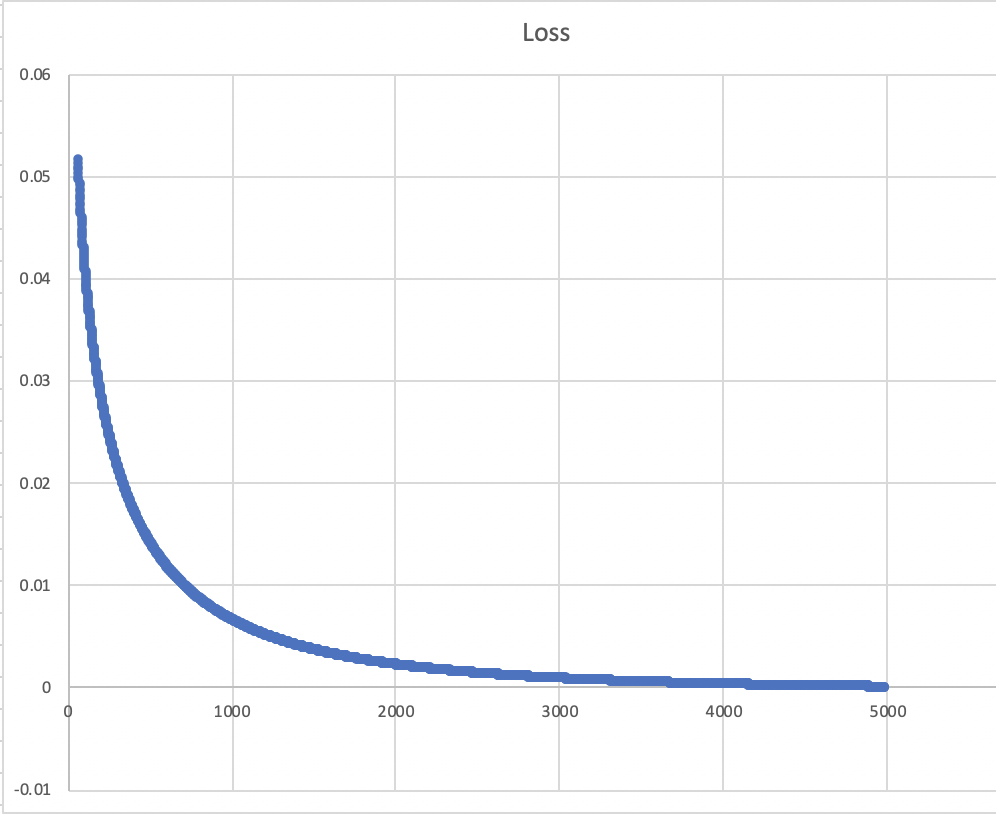

## Logistic Regression
Implementation of a binary logestic regression algorithm in Rust.  
Utilizes the Nalgebra create for linear algrebra.
Uses [UCI's Banknote Authentication Dataset an an example](https://archive.ics.uci.edu/ml/datasets/banknote+authentication).

### Loss over time for the Banknote Authentication Dataset:

### Questions I had:
- (Rust): was use of clone() excessive?
- (ML): was adding a column of 1's the best way to add the bias feature?
- (ML): is negative loss an ok appearance for logistic regression?

### Todo:
- Add support for multiclass classification
- Auto-read csv files

